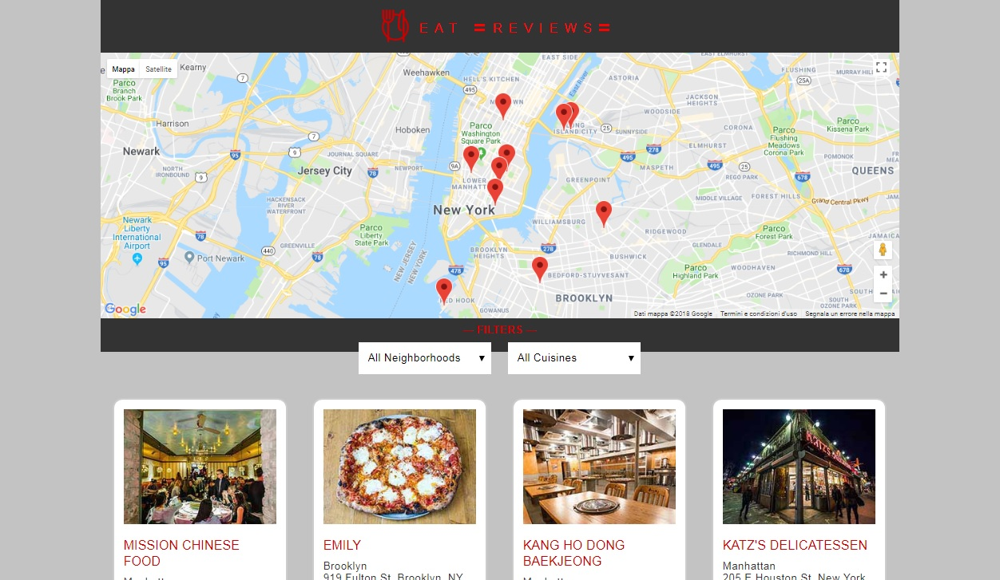
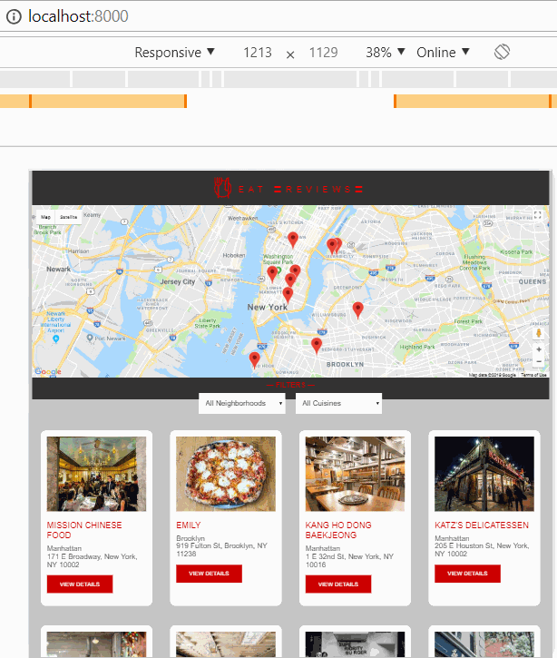

# Udacity Mobile Web Specialist Certification Course
---
#### _Three Stage Course Material Project - Restaurant Reviews_
https://www.udacity.com/course/mobile-web-specialist-nanodegree--nd024

## Project Brief

To achieve Udacity certification I made a restaurant reviews application with a focus on accessibility and usability even offline. 
For the development Udacity provided a node server that send a JSON with restaurants informations. The index page include a restaurants list based on results of Google Maps location (in production could be the result of user's geolocation) and the application include multiple ways to filter the restaurants. In the restaurant info page there is the name, an image, address and operating hours with reviews. The reviews include the name of the reviewer, date of review, 5-star rating system, and comments. When viewing a specific restaurant, current reviews is displayed along with a form for the user to submit their own review. It's possible to send a review even offline with background synchronization.

## App feature

- **Full offline application** with restaurant informations, customer reviews and a review form.
- Background sycn for retry posting data when user offline.
- Lighthouse score over 90 for "Performance", "Progressive Web App" and "Accessibility".
- Made with **responsive design** to ensure a good user experience for all devices.
- All content-related images include an appropriate alternate text.
- Focus is appropriately managed allowing users to tab through each elements of the page.
- A skip link is applied on Google Maps to allow users to skip it and quickly access the document's main. 
- Elements on the page use the appropriate semantic elements according with **ARIA roles** best practices.
- Design made with focus on **accessibility**.

## My App - Eat Restaurant Review

## Offline Functionality

### Lighthouse audits

## Recommendations

Download the node server provided here: 
-> https://github.com/udacity/mws-restaurant-stage-3
and follow the included instructions into README to run it

To have localhost I used "npm serve" https://www.npmjs.com/package/serve on port 8000 

-> serve -p 8000

When testing offline review post do not use chrome devtools offline, instead turn off your computers network to see background sync on work.

## Resources used as inspiration

For indexedDB: 
Stage 1 and 2 
https://gist.github.com/BigstickCarpet/a0d6389a5d0e3a24814b 
https://developer.mozilla.org/en-US/docs/Web/API/IndexedDB_API/Using_IndexedDB 
Stage 3 
https://github.com/jakearchibald/idb 

For background sync: 
https://developers.google.com/web/updates/2015/12/background-sync 
https://www.twilio.com/blog/2017/02/send-messages-when-youre-back-online-with-service-workers-and-background-sync.html
